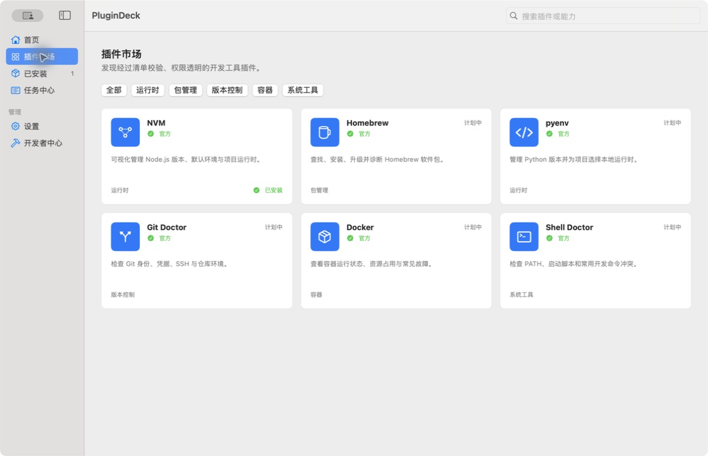
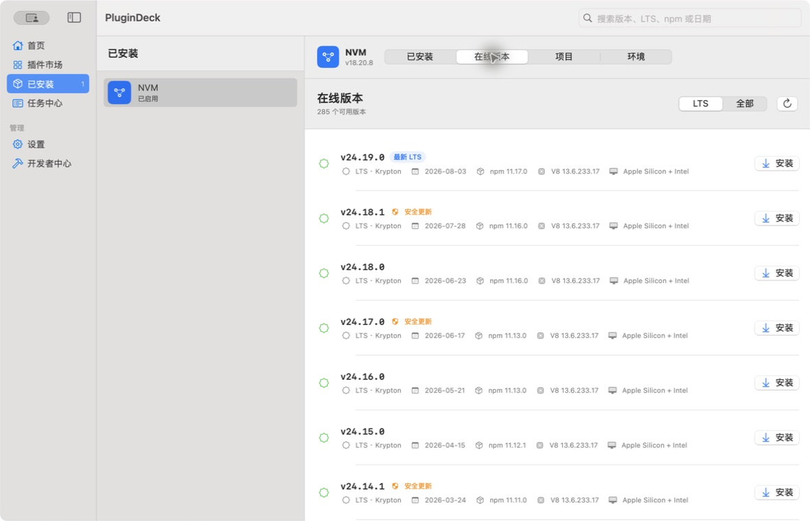
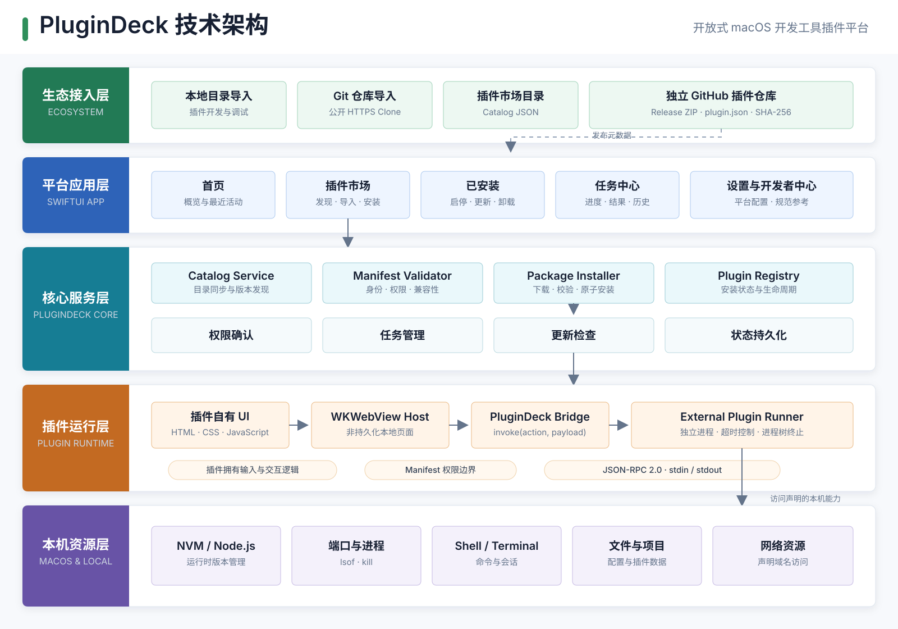

# PluginDeck

PluginDeck 是一个开源的 macOS 开发者插件工作台。它把 NVM、Homebrew、pyenv、Git 等命令行开发工具组织成可发现、可授权、可安装、可追踪的图形化插件。

> 当前状态：早期开发版。平台骨架、独立 NVM / Port Manager 插件和插件自有页面协议已经可运行。





## 技术架构



PluginDeck 采用宿主平台与插件能力分离的五层架构。平台负责插件发现、校验、安装、授权、进程调度和任务记录；插件负责自己的界面、输入与业务逻辑，并通过 JSON-RPC 2.0 独立进程访问声明的本机能力。

## 为什么做 PluginDeck

独立的工具面板很快会变成一组互不相通的应用。PluginDeck 负责共用能力：插件发现、来源与权限展示、安装和更新、任务日志、禁用、卸载及回滚。每个插件只专注于一种开发工具。

## 当前功能

- 原生 SwiftUI macOS 宿主应用
- 首页、插件市场、已安装、任务中心、设置与开发者中心
- 版本化 `plugin.json` 清单模型
- 插件来源、信任级别、权限、网络域名和兼容性展示
- 安装、启用、停用、卸载和本地状态持久化
- 独立 NVM 插件：已安装版本、在线版本、项目与环境四个完整区域
- Node.js 发布日期、LTS、npm、V8、安全更新和 Mac 架构元数据
- `nvm install` 安装进度、实时日志、取消、查询重试和下载停滞恢复
- `.nvmrc` / `.node-version` / `package.json` 检测及项目一键就绪
- NVM 路径、Shell、Terminal 权限健康检查及自定义 NVM 目录
- 与插件任务同步的统一任务记录
- JSON-RPC 2.0 进程协议基础类型
- 从本地目录或公开 HTTPS Git 仓库导入社区插件
- 从远程 Marketplace Catalog 下载并校验 Release ZIP
- 外部插件独立进程动作、可配置超时和统一任务记录
- 插件自带 HTML/CSS/JavaScript 工作区及受控宿主桥接

## 本地运行

要求 macOS 13 或更高版本，以及 Swift 6 / Xcode 16。

```bash
swift run PluginDeck
```

运行测试：

```bash
swift test
```

构建可直接安装的 DMG：

```bash
APP_VERSION=0.5.1 ./scripts/build-dmg.sh
```

生成文件位于 `dist/PluginDeck-0.5.1.dmg`。项目通过 GitHub Releases 分发，不要求通过 Mac App Store 发布。未使用 Apple Developer ID 签名的构建首次打开时可能需要在“系统设置 -> 隐私与安全性”中确认。

## 插件架构

第三方插件不会作为 Swift 动态库加载进宿主进程。插件可以携带自己的本地 HTML 工作区，交互通过受控桥接调用独立后端进程；后端使用版本化 JSON-RPC 协议与宿主通信。安装前宿主验证：

- manifest schema 与插件 ID
- macOS、CPU 架构和宿主 API 兼容性
- 下载包 SHA-256
- 声明权限及允许访问的网络域名
- 发布来源与信任级别

详细规范见 [插件规范](docs/PLUGIN_SPEC.md) 和 [架构说明](docs/ARCHITECTURE.md)。

最小外部插件示例位于 [`examples/hello-plugin`](examples/hello-plugin)。打开“插件市场”，选择“导入插件 -> 从本地目录导入”，即可验证从清单检查、权限确认、安装到 JSON-RPC 动作执行的完整链路。

## 路线图

- Marketplace 提交审核与恶意版本撤回列表
- 插件版本固定与回滚
- 项目目录授权和长任务实时日志/取消
- Homebrew、pyenv、Git Doctor 等开发工具插件

## 参与贡献

欢迎提交 Issue 和 Pull Request。涉及插件权限、安装器或进程通信的改动，请同时说明安全边界和失败恢复方式。

## License

[MIT](LICENSE)
